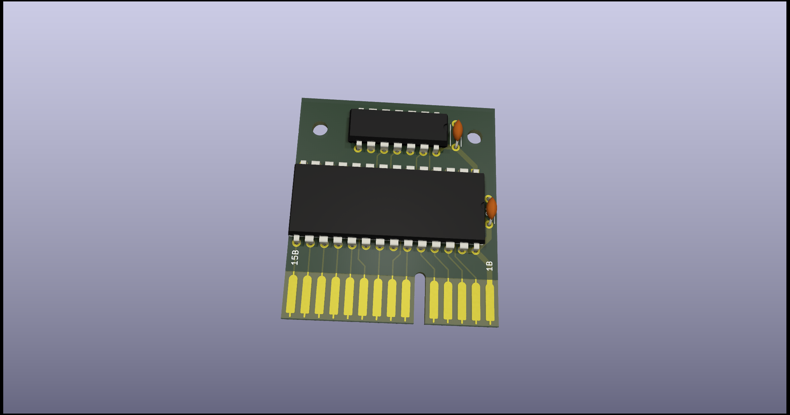
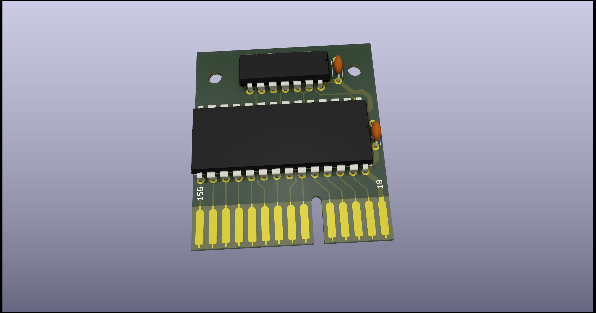
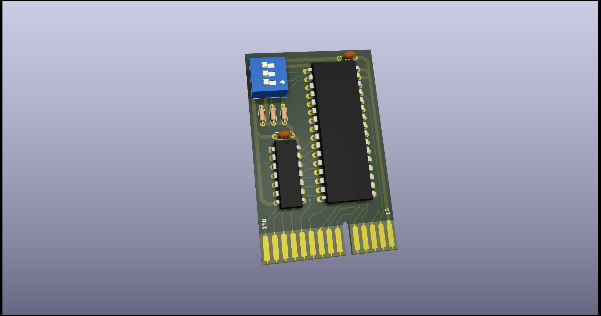

# QL_Rom_Cartridge
Schematic, PCB and other stuff to make ROM Cartridge for use with Sinclair QL Computer

(C) 2022 Alvaro Alea Fdz.

License under: CERN Open Hardware Licence Version 2 - Strongly Reciprocal

https://ohwr.org/cern_ohl_s_v2.txt

## Folder: Original
This folder contain the schematic of the original Sinclair cartridge as far as i can get from pictures from internet.

 

It also contains 3D pieces to do vacum form of the case

STATUS
- Schematic - Working, tested
- Case - Design, Non tested

## Folder: Short

### NOT TESTED, SHOULD WORK
This version need a 16Kb eprom, and is intended as a replacement of Toolkit II cartridge an others.

## Folder: full_rom

### NOT TESTED, NO IDEA IF WORK
This version need a 64Kb eprom, and is intended to replace the internal ROM of the QL.

Is very important to remove the 2 ROM chips from the QL before use.

Be aware that this lock the rom cartridge, and the QL will not work without it.

## Folder: 8full_rom

### NOT TESTED, NO IDEA IF WORK
The 8full_rom is a version of full_rom with 3 switch to allow 8 diferent version of the ROM of the QL.

Is very important to remove the 2 ROM chips from the QL before use.

Be aware that this lock the rom cartridge, and the QL will not work without it.

