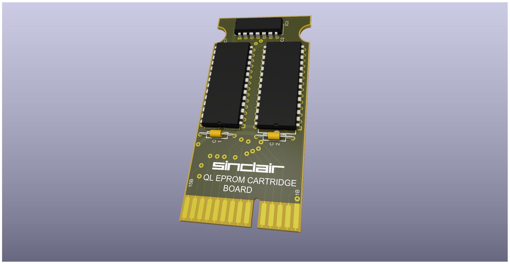

# QL_Rom_Cartridge
Schematic, PCB and other stuff to make ROM Cartridge for use with Sinclair QL Computer

License under: CERN Open Hardware Licence Version 2 - Strongly Reciprocal
https://ohwr.org/cern_ohl_s_v2.txt

## Folder: Original
This folder contain the schematic of the original Sinclair cartridge as far as i can get from pictures from internet.

 

It also contains 3D piezes to do vacum form of the case

STATUS
- Schematic - Working, tested
- Case - Design, Non tested
